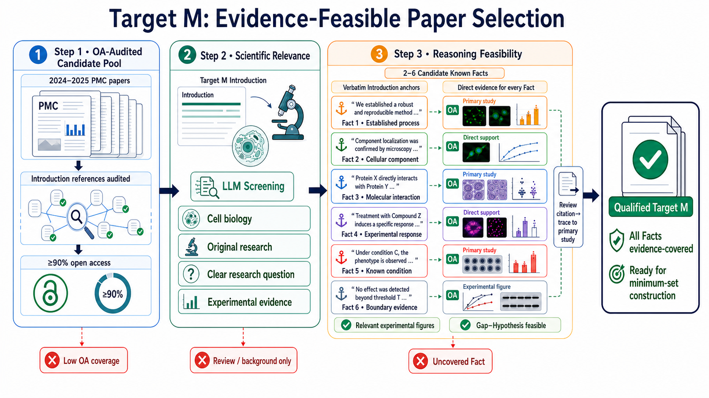
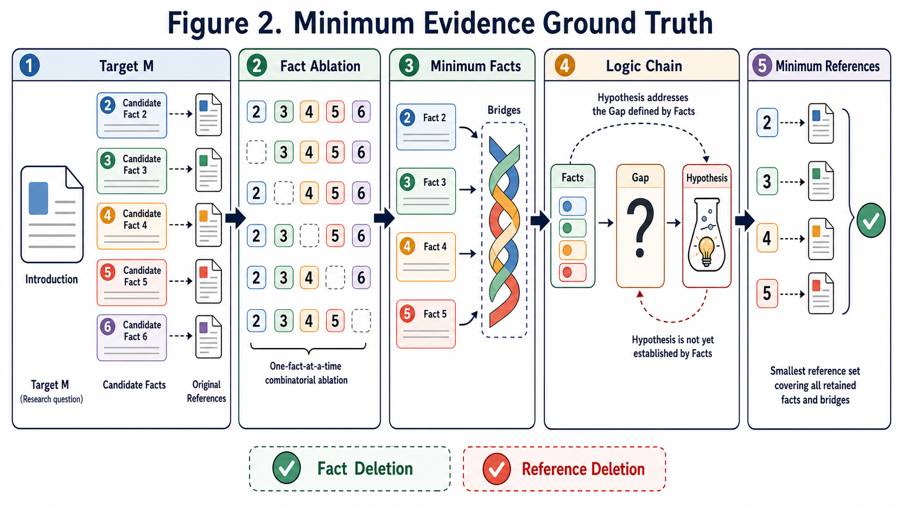
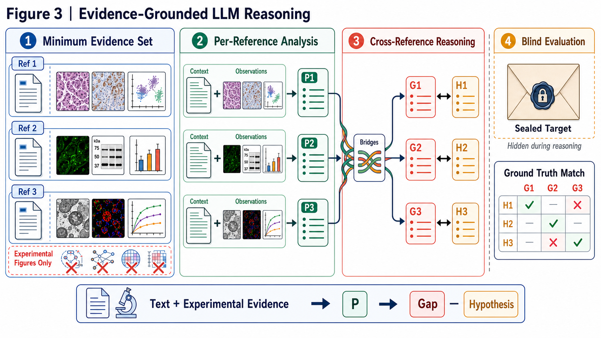

# Hypothesis Benchmark

本项目构建一个基于生物文献的科学假设生成基准，用来回答一个问题：**只向大模型提供目标论文发表前已经存在的证据，模型能否独立发现知识空白，并提出接近真实研究方向的可验证假设？**

整体流程分为三个步骤：

1. **Target M**：筛选科学问题清楚、证据可追溯的目标论文。
2. **Minimum Set**：从目标论文中构建最小事实集、逻辑链和最小参考文献集。
3. **LLM Reasoning**：隐藏目标论文，让模型只根据最小证据集生成知识空白和假设。

```text
Target_M  →  Minimum_set  →  LLM_Reasoning
目标论文      最小证据标准答案      盲测假设生成
```

---

## 步骤一：Target M——筛选证据可行的目标论文



### 核心思想

Target M 是后续基准中的目标论文。论文不仅要有明确的细胞生物学研究问题和实验结果，还必须能够从引言中的每个关键已知事实，追溯到开放获取的原始研究证据。这样才能在不泄漏目标论文答案的情况下，重建它发表前的知识背景。

该阶段包含三层筛选：开放获取可用性、科学相关性、推理证据可行性。

### 1.1 构建开放获取候选池

主要代码：

- `Target_M/OA-step1_collect_pmc.py`：按照图中的 OA 审计流程收集候选论文。它检查目标论文引言引用的文献是否可以开放获取，并根据 OA 覆盖率保留候选论文。
- `Target_M/step1_collect_pmc.py`：从 PubMed Central 按年份收集论文，执行基础规则过滤、主题分类和均衡采样，生成候选数据集。
- `Target_M/pmc_m/pmc.py`：封装 NCBI/PMC 查询、全文 XML 下载、JATS 解析、正文分段和候选论文采样。
- `Target_M/pmc_m/rules.py`：定义论文类型和标题过滤规则，排除综述、预印本、撤稿、无摘要论文及其他不适合充当 Target M 的文章。

实现方法：

1. 按指定年份在 PMC 中检索开放获取论文。
2. 解析论文题目、摘要、类型、年份和全文结构。
3. 使用硬规则排除不合格论文，并将论文分配到研究主题类别。
4. 审计引言参考文献的 OA 状态；OA 覆盖率不足的论文被排除。
5. 将合格论文写入 `step1/eligible.csv` 和对应 JSONL 文件，供下一层筛选使用。

### 1.2 筛选科学相关性

主要代码：

- `Target_M/step2_llm_screen.py`：读取候选论文全文，调用 LLM 完成结构化科学质量审查，并保存每篇论文的判断和理由。
- `Target_M/pmc_m/llm.py`：定义审查提示词、评价维度、模型调用和 JSON 结果校验。
- `Target_M/pmc_m/config.py`：统一读取 NCBI 和 DeepSeek 的 API 配置。

实现方法：

LLM 根据论文全文判断它是否满足以下条件：

- 属于细胞生物学相关研究；
- 是原始研究，而不是综述或背景介绍；
- 具有明确、可识别的研究问题；
- 包含能够回答该问题的实验数据和证据。

只有所有必要条件都通过的论文才进入第三层。程序会保存已处理状态和审查结果，支持分批运行与断点续跑。

### 1.3 检查推理证据是否可行

主要代码：

- `Target_M/step3_reference_feasibility.py`：逐篇检查候选论文，提取已知事实并验证参考文献证据，生成最终合格论文列表。
- `Target_M/pmc_m/feasibility.py`：实现事实提取、原文锚点验证、参考文献解析、证据配对和综述引用回溯。

实现方法：

1. 从目标论文的摘要和引言中提取 2–6 个候选已知事实。
2. 要求每个事实都带有可在引言中逐字定位的文本锚点和明确引用。
3. 下载被引用论文，判断它是否直接支持对应事实。
4. 如果引言引用的是综述，则继续沿综述引用追踪到原始研究论文。
5. 检查证据论文是否开放获取、是否包含相关实验图，以及全部事实能否形成“事实—知识空白—假设”的可行推理基础。
6. 任一必要事实没有直接证据时，目标论文被排除；全部事实均有证据覆盖时，论文成为 Qualified Target M。

主要输出位于 `Target_M/data/<dataset>/step3/`：

- `final.jsonl` / `final.csv`：最终合格的 Target M；
- `excluded.jsonl` / `excluded.csv`：被排除论文及原因；
- `reasoning_inputs/`：事实、引文、证据匹配和可行性审计结果；
- `summary.json`：本次筛选的统计摘要。

---

## 步骤二：Minimum Set——构建最小证据 Ground Truth



### 核心思想

一篇目标论文的引言可能包含许多事实和引用，但并不是所有内容都对定义知识空白和提出假设不可缺少。本阶段通过**事实消融**和**最小集合覆盖**，找出能够保持原始逻辑链的最少事实，以及覆盖这些事实和桥接关系的最少参考文献。

最终得到的不是简单的参考文献列表，而是一份可验证的标准答案：

```text
最小已知事实 → 事实之间的桥接关系 → 知识空白 → 真实假设
```

### 2.1 准备本地证据包

主要代码：

- `Minimum_set/step1_prepare_data.py`：读取 Target M 第三层的合格结果，逐篇建立本地数据包。
- `Minimum_set/mrrs/ncbi.py`：解析引言引用，获取参考文献的 PMCID、PMID、DOI 和全文。
- `Minimum_set/mrrs/package.py`：保存目标论文、参考论文、全文、图注、图片和元数据，并生成清单文件。

实现方法：

1. 读取 Target M 中已经验证的候选事实和对应参考文献。
2. 保存目标论文的引言、元数据和候选推理信息。
3. 下载每篇证据论文的 XML 全文，并提取正文、图注和可用图片。
4. 生成 `manifest.json`、`fact_coverage.json` 和 `fact_reference_map.json`，明确每个事实由哪些文献支持。

### 2.2 事实组合消融

主要代码：

- `Minimum_set/step2_build_ground_truth.py`：批量调用 ground-truth 构建流程并保存结果。
- `Minimum_set/mrrs/ground_truth.py`：枚举事实子集、调用 LLM 评估子集、选择最小充分事实集，并构建桥接关系。

实现方法：

1. 对 2–6 个候选事实枚举允许的组合。
2. 逐个删除事实，判断剩余事实是否仍能定义与目标论文相同的知识空白，并支持同一个假设。
3. 删除后逻辑仍完整的事实被视为非必要事实；删除后逻辑断裂的事实被保留。
4. 在所有充分组合中优先选择事实数量最少的组合。
5. 对保留事实之间的桥接关系进行验证，确保逻辑链不是事实的简单堆积。

### 2.3 求解最小参考文献集合

主要代码：

- `Minimum_set/mrrs/solver.py`：使用精确集合覆盖算法寻找全局最小参考文献集合，并执行删除测试。

实现方法：

1. 将最小事实和桥接关系视为必须被覆盖的证据单元。
2. 将每篇参考论文表示为它能够直接支持的证据单元集合。
3. 枚举并比较参考文献组合，找出覆盖全部证据单元的最小集合，而不是使用可能得到局部最优结果的贪心选择。
4. 再分别删除每篇入选文献。如果删除后出现未覆盖事实或桥接关系，说明该文献确实是必要的。

主要输出位于 `Minimum_set/data/step2/`：

- `<PMCID>_ground_truth.json`：每篇 Target M 的最小证据标准答案；
- `run_summary.json`：批量处理结果；
- `cache/`：模型调用缓存。

Ground Truth 的核心内容包括最小已知事实、知识空白、真实假设、事实桥接关系、最小参考文献集合以及事实/文献删除验证结果。

---

## 步骤三：LLM Reasoning——基于证据独立生成假设



### 核心思想

本阶段模拟研究者在目标论文发表前的状态。目标论文及其真实知识空白和假设会被密封，模型只能读取 Minimum Set 中的参考论文证据。模型先独立分析每篇文献，再跨文献组合结论，最终生成一一对应的 Knowledge Gap 和 Hypothesis。

需要注意：当前 DeepSeek 实现会在本地保留实验图片，但发送给模型的是论文正文、图注和 Results 中的文字证据，**不会把图片像素发送给 DeepSeek**。因此代码中的图像观察属于文本和图注支持的 `TEXT_DERIVED_FIGURE_EVIDENCE`，不能表述为模型直接看图得到的结论。

### 3.1 导入最小证据集并密封答案

主要代码：

- `LLM_Reasoning/import_minimum_set.py`：把 Minimum Set 输出转换为统一的推理数据集格式。

实现方法：

1. 读取最小参考文献集合及其全文、图注和实验图片。
2. 为每篇参考文献建立唯一 ID、路径、校验值和事实覆盖记录。
3. 将目标论文的真实 Gap 和 Hypothesis 写入单独的 sealed target 文件。
4. 标记密封文件在推理阶段不可访问，只允许在推理完成后用于评测，防止答案泄漏。

### 3.2 筛选真实实验图证据

主要代码：

- `LLM_Reasoning/prepare_reasoning_dataset.py`：根据图注和论文信息筛选实验图，并生成整理后的数据清单。

实现方法：

1. 读取每篇参考论文的图注和图片清单。
2. 保留显微镜、组织学、免疫荧光、Western blot、实验测量曲线等真实实验数据图。
3. 排除机制示意图、流程图、模拟图、网络图、装饰图和无法确认的图片。
4. 保存入选图片及审计记录，明确每张图被保留或排除的原因。

### 3.3 单篇文献证据分析

主要代码：

- `LLM_Reasoning/run_deepseek_reasoning.py` 中的 reference analysis 阶段。

实现方法：

1. 每篇参考文献独立处理，避免模型提前混合不同论文的结论。
2. 从正文 Results 和入选实验图的图注中提取客观观察，包括实验组、处理条件、测量指标和变化方向。
3. 将观察归纳为 2–6 个原子化的 paper-local subconclusions（P1、P2、P3……）。
4. 每个子结论必须带有文本锚点或图注证据，不允许使用外部知识，也不能访问 Target M 的答案。

### 3.4 跨文献推理并生成假设

主要代码：

- `LLM_Reasoning/run_deepseek_reasoning.py` 中的 joint reasoning 阶段。
- `LLM_Reasoning/batch_io.py`：负责批量 CSV 读取、任务区间选择、结果保存和断点续跑。

实现方法：

1. 组合至少两篇不同参考论文的局部子结论。
2. 显式记录连接不同论文结论的 evidence bridge。
3. 找出任何单篇论文都尚未回答的精确关系，形成 Knowledge Gap。
4. 针对每个 Gap 生成一个方向明确、可以被实验推翻的 Hypothesis。
5. 强制 Gap 与 Hypothesis 一一对应，并检查引用 ID、证据来源和 JSON 结构是否完整。

推理结果包含每篇论文的证据观察、局部子结论、跨文献组合、Knowledge Gap 集合和 Hypothesis 集合。完成推理后，才使用密封的 Target M Ground Truth 进行盲评，比较模型假设与真实研究方向的匹配程度。

---

## 项目结构

```text
Hypothesis_Barchmark/
├── Target_M/          # 步骤一：目标论文筛选与证据可行性检查
├── Minimum_set/       # 步骤二：最小事实、逻辑链和最小参考文献
├── LLM_Reasoning/     # 步骤三：证据分析、跨文献推理和假设生成
├── figures/readme/    # README 使用的三张流程图
└── README.md
```

## 总结

本项目先找到一篇科学问题明确且历史证据完整的目标论文，再用消融与集合覆盖方法还原提出该假设所需的最小证据，最后隐藏真实答案，测试大模型能否沿着“实验与文本证据 → 局部结论 → 跨论文桥接 → 知识空白 → 可证伪假设”的路径独立完成科学推理。
